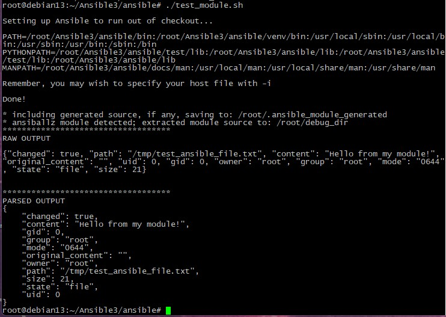
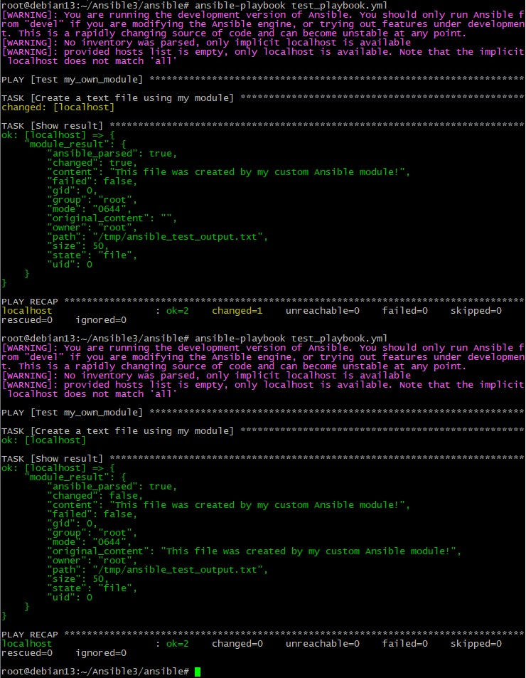
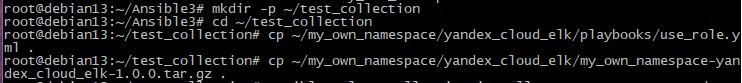
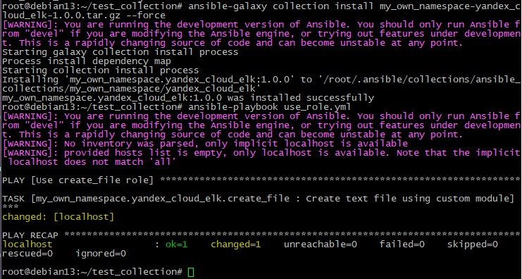

### Домашнее задание "Создание собственных модулей" - Князев Евгений

Шаг 4. Проверьте module на исполняемость локально. 

Шаг 6. Проверьте через playbook на идемпотентность. 

Шаг 14. Создайте ещё одну директорию любого наименования, перенесите туда single task playbook и архив c collection. 

Шаг 16. Запустите playbook, убедитесь, что он работает. 

Ссылка на репозиторий: 
https://github.com/ZoooMBoooM/my_own_collection